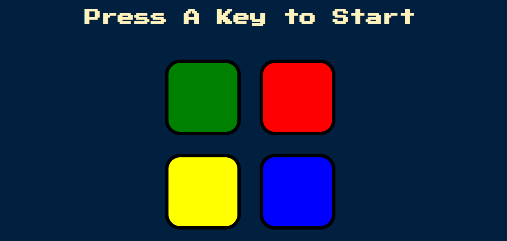

# Simon Game Challenge

## Table of contents

- [Overview](#overview)
  - [The challenge](#the-challenge)
  - [Screenshot](#screenshot)
  - [Links](#links)
- [My process](#my-process)
  - [Built with](#built-with)
  - [What I learned](#what-i-learned)
- [Author](#author)

## Overview

### The challenge

The challenge was to build a memory game which gets complex after each patterns.

Firstly, the game shows the first colour in the sequence (blue). The user clicks on the blue button.

Next, the game shows the next colour (red), the user has to remember the sequence is blue, red and so on and so forth.

If the user messes up the sequence, then the game ends.

### Screenshot

### Links

- Solution URL: (https://github.com/Radhakrishnan-R/simon-game-challenge/blob/main/index.js)
- Live Site URL: (https://radhakrishnan-r.github.io/simon-game-challenge/)

## My process

### Built with

- Semantic HTML5 markup
- CSS custom properties
- Flexbox
- Mobile-first workflow

### What I learned

This project has helped me a lot to solidify javascript knowledge.
To script a code to validate each pattern was fun to build.

## Author

- Website - [Radhakrishnan R](https://radhakrishnans-portfolio.webflow.io/)
- Frontend Mentor - [Radhakrishnan-R](https://www.frontendmentor.io/profile/Radhakrishnan-R)

